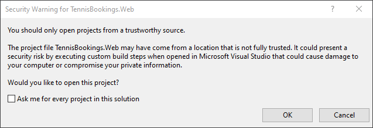

# Prerequisites

- .NET Core SDK 6.0+
- Visual Studio 222 or alternative editor such as VS Code

# Configuration Steps Required to Run Sample

1: Open the TennisBookings.sln in Visual Studio.

*If prompted with a security warning, deselect "Ask me for ever project in this solution" and click "OK".*

2: Set startup project...

- Right click on the TennisBookings project and choose "Set as Startup Project".

3: Press F5 to start debugging the application.

# Usernames

To login as a member use the username 'member@example.com' and the password 'password'.

To login as an administrator use the username 'admin@example.com' and the password 'password'.